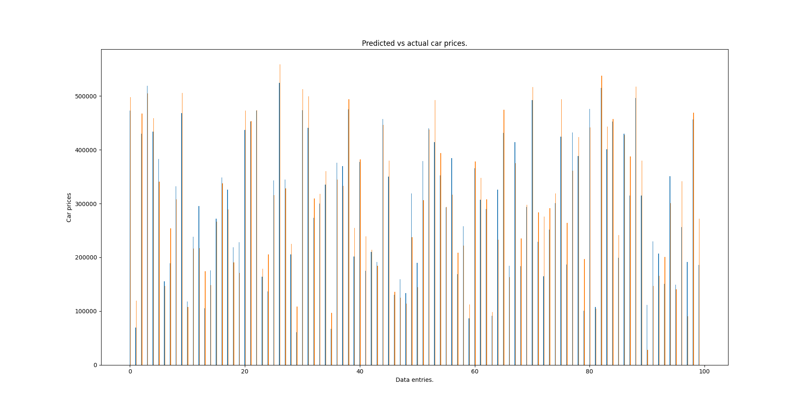

#### Linear regression model for car price prediction.

Model works fine with accurate predictions.
Bar graph of actual prices to predicted.

### Model summary:
#### *Model: "sequential"*

| Layer (type)   | Output Shape  |      Param #     |
|---             |    ---        |        ---       |
| normalization (Normalization)  | (None, 8)  |  17 |
| dense (Dense)  | (None, 64)                 |  576|
| dense (Dense)  | (None, 128)              | 8320  |
| dense (Dense)  | (None, 64)               | 8320  |
| dense (Dense)  | (None, 1)                | 8320  |

________________________________________________________________
- Total params: 17234 (67.32 KB)
- Trainable params: 17217 (67.25 KB)
- Non-trainable params: 17 (72.00 Byte)
_________________________________________________________________

